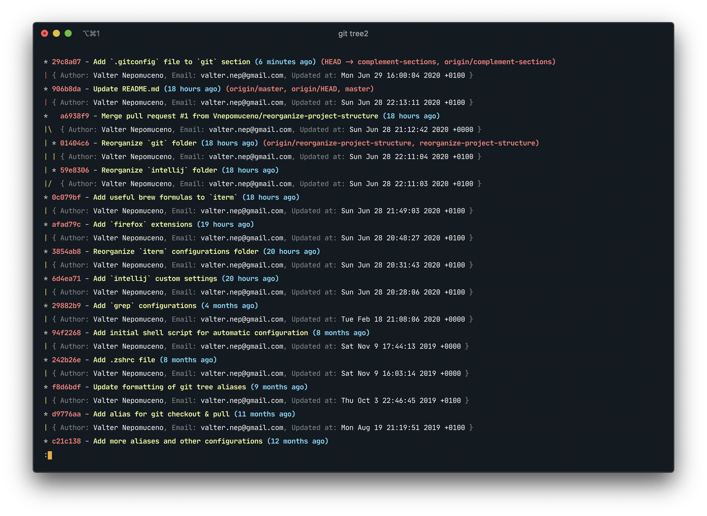
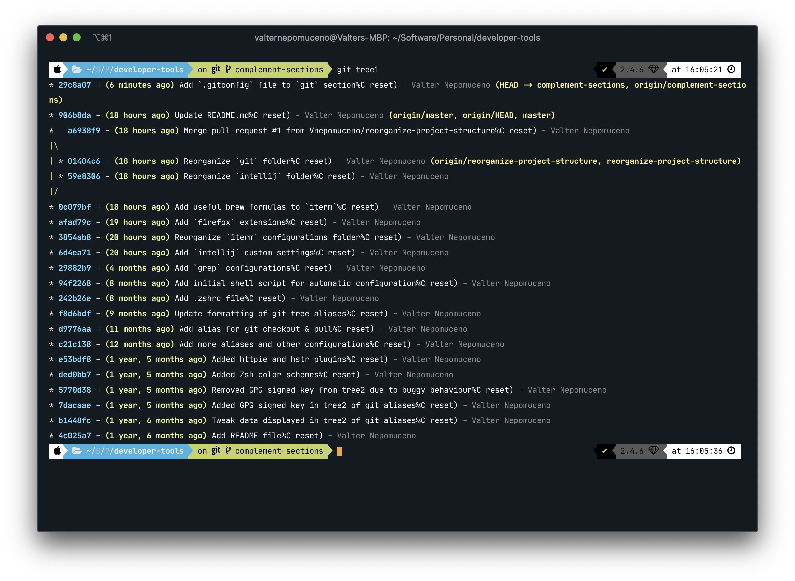
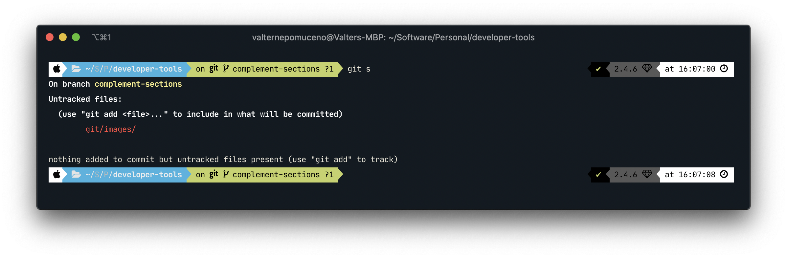

# Git

## Custom Git Config

Custom file `.gitconfig` [here](.gitconfig).

## Commit Signature Verification

Read GitHub documentation on how to [manage commit signature verification](https://help.github.com/en/github/authenticating-to-github/managing-commit-signature-verification), and follow the suggested steps.

## Custom Aliases

### Log

`$ git tr` and `$ git tree2`

`$ git tree1`

### Status

`$ git s`

