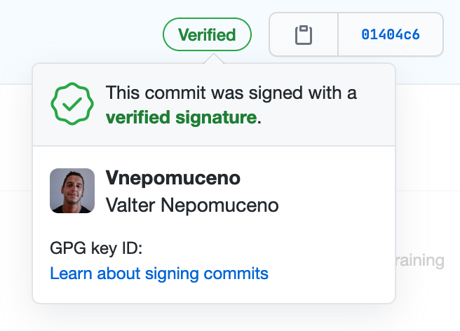

# Git

## Custom Git Config

Custom file `.gitconfig` [here](../dotfiles/.gitconfig).

## Commit Signature Verification

Read GitHub documentation on how to [manage commit signature verification](https://help.github.com/en/github/authenticating-to-github/managing-commit-signature-verification), and follow the suggested steps.

